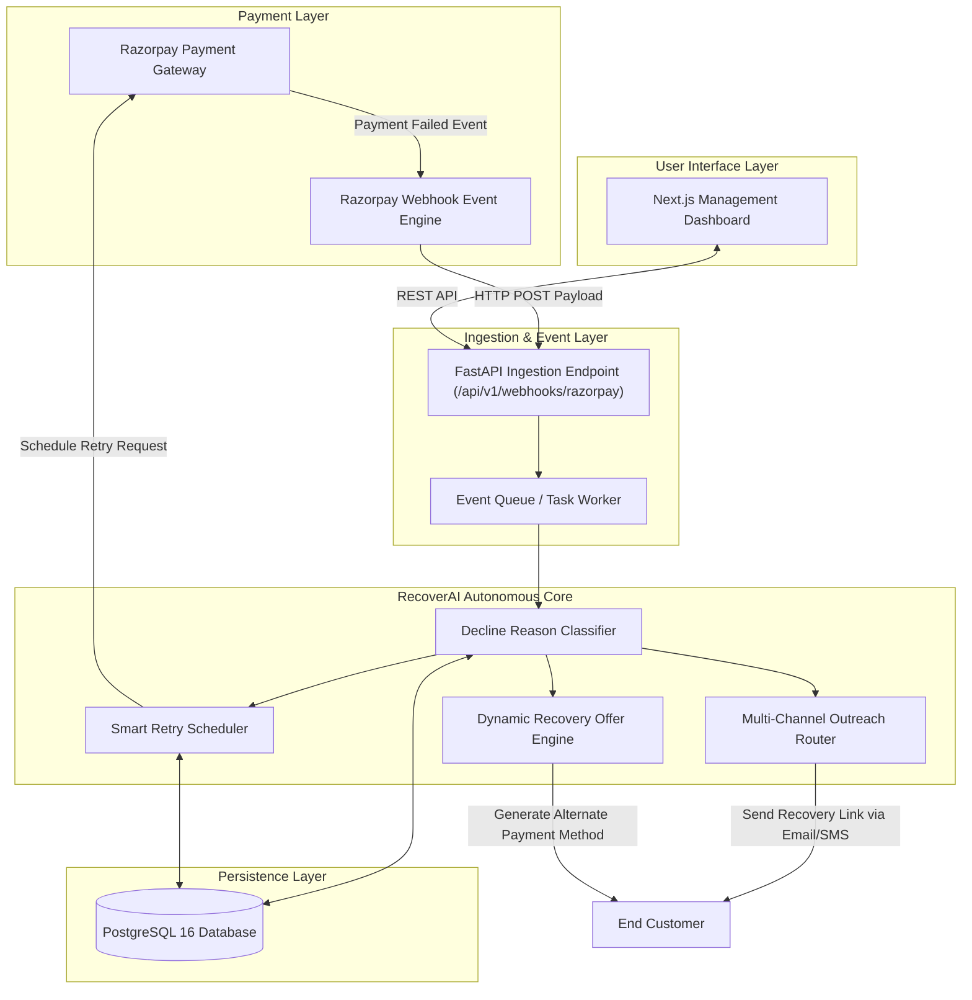

# System Architecture — RecoverAI

## 1. Executive Summary

**RecoverAI** is an autonomous revenue recovery system engineered for subscription businesses. When recurring payment renewals fail (due to card expiry, insufficient funds, or soft decline errors), RecoverAI intercepts payment failure events, analyzes the root cause, and executes intelligent recovery workflows.

---

## 2. High-Level Architecture Diagram

---

## 3. Subsystem Breakdown

### 3.1 Ingestion & Event Layer
- **Razorpay Webhooks:** Captures real-time events such as `subscription.charged_failed`, `payment.failed`, `invoice.payment_failed`.
- **FastAPI Webhook Listener:** Validates webhook signature HMACs, extracts transaction metadata, and logs raw payloads to PostgreSQL.

### 3.2 Autonomous Core (Agent Engine)
- **Decline Reason Classifier:** Categorizes error codes into:
  - *Hard Declines* (e.g., card stolen, account closed) $\rightarrow$ Immediate notification to customer to update payment details.
  - *Soft Declines* (e.g., temporary bank processing delay, insufficient funds) $\rightarrow$ Smart retry scheduling.
- **Smart Retry Scheduler:** Calculates optimal re-attempt windows (e.g., salary cycle timing, off-peak processing hours).
- **Multi-Channel Communication Router:** Triggers personalized messaging via Email/SMS/WhatsApp containing one-click payment links.

### 3.3 Persistence Layer (PostgreSQL)
Stores:
- Customer payment profiles and subscription states
- Transaction failure logs & error telemetry
- Active recovery workflows and retry schedules
- Recovery metrics (Recovered ARR, Success Rate, Churn Reduction)

### 3.4 Presentation Layer (Next.js Dashboard)
- **Overview Dashboard:** Total Revenue Saved, Recovery Rate, Active Interventions.
- **Transaction Explorer:** Filterable list of failed transactions and recovery progress.
- **Agent Controls:** Configure retry rules, communication templates, and manual override capabilities.

---

## 4. Planned Data Flow Sequence

1. **Failure Event:** Customer subscription payment fails on Razorpay.
2. **Webhook Dispatch:** Razorpay fires a webhook payload to RecoverAI backend.
3. **Payload Verification:** Backend verifies payload signature and registers failure record.
4. **Classification & Strategy:** Recovery Agent evaluates error payload and picks a strategy.
5. **Action Execution:**
   - Soft decline: Enqueues a scheduled retry.
   - Hard decline: Dispatches automated payment update request.
6. **Resolution:** Payment succeeds on retry or alternate link $\rightarrow$ Recovery logged & dashboard updated.
